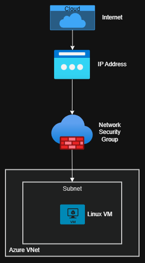

# Cloud Infrastructure with Terraform (Azure)

> Production-like Azure infrastructure deployed with Terraform — VNet, Subnet, NSG, Linux VM, Public IP.

---

## Overview

This project demonstrates how to deploy a **secure and production-like infrastructure on Microsoft Azure** using Terraform.
It simulates a real enterprise setup commonly used in banking, financial services, and regulated environments, focusing on networking isolation, security best practices, and Infrastructure as Code (IaC).

---

## Architecture Diagram



---

## Architecture

```text
Resource Group
└── Virtual Network (10.0.0.0/16)
    └── Subnet (10.0.1.0/24)
        └── Network Security Group (allow SSH / deny all)
            └── Network Interface
                └── Linux VM (Ubuntu 22.04)
                    └── Public IP (Static)
````

---

## Technologies

| Tool                 | Purpose                |
| -------------------- | ---------------------- |
| **Terraform**        | Infrastructure as Code |
| **Microsoft Azure**  | Cloud Provider         |
| **Ubuntu 22.04 LTS** | VM Operating System    |
| **Azure NSG**        | Network Security       |

---

## What This Project Covers

* ✅ Resource Group with environment tags
* ✅ Virtual Network + Subnet segmentation
* ✅ Network Security Group with explicit allow/deny rules
* ✅ Static Public IP allocation
* ✅ Linux VM deployment with SSH key authentication
* ✅ Input variables for reusability
* ✅ Outputs for key resource values
* ✅ Tagging strategy (environment, project, managed_by)

---

## How to Run

```bash
# 1. Clone the repo
git clone https://github.com/gonzalezluizpro/terraform-azure-production-like
cd terraform-azure-production-like

# 2. Login to Azure
az login

# 3. Initialize Terraform
terraform init

# 4. Review the plan
terraform plan

# 5. Deploy infrastructure
terraform apply

# 6. Destroy when done
terraform destroy
```

---

## What I Learned

* Infrastructure as Code principles with Terraform
* Azure networking: VNet, Subnet, NSG associations
* State management and Terraform lifecycle
* Security rule design (least privilege: allow SSH, deny all others)
* Modular variable design for environment reuse

---

## Author

**Luiz Assef**  
📍 Luxembourg  
🌐 [Portfolio](https://github.com/gonzalezluizpro/Cloud-Portfolio)  
💼 [LinkedIn](https://linkedin.com/in/luizgonzalezpro)  

---
